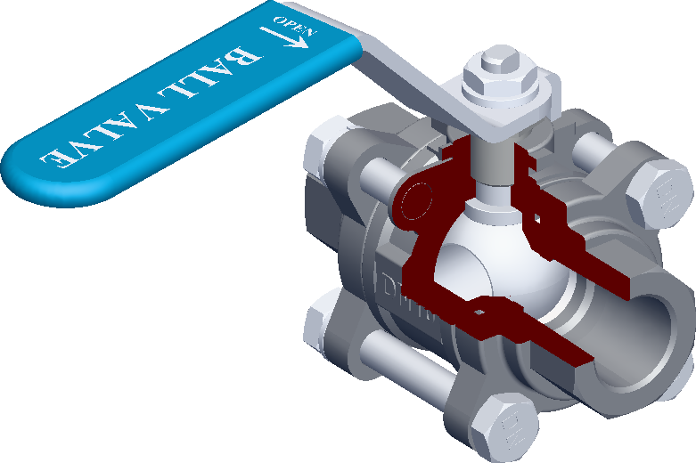

# m3dv
3D model viewer

This package is UI agnostic which means that you need to build it yourself. Viewer provides various properties and events to build own reactive viewer interface


## Install
use `npm i m3dv` to install this package

## Usage
### Viewer creation
You can simply create `Viewer` object

```js
const canvas = document.getElementById("canvas") as HTMLCanvasElement;
const viewer = new Viewer(canvas);
```

### Model loading
To load model file use `LoadModelFile()` method of `Viewer` object
```js
viewer.LoadModelFile("fileNameWithExtension.gltf", "UrlToFile");
```

### CAD models
In order to load CAD models you can specify wasm path to `occt-import-js`
```js
const occtImportJsWasmPath = new URL("pathToWasm/occt-import-js.wasm", import.meta.url).href;
const viewer = new Viewer(canvas, { occtImportJsWasmPath: occtImportJsWasmPath });
```

see [example](./examples/) folder to see basic usage of viewer 

## Showcase




